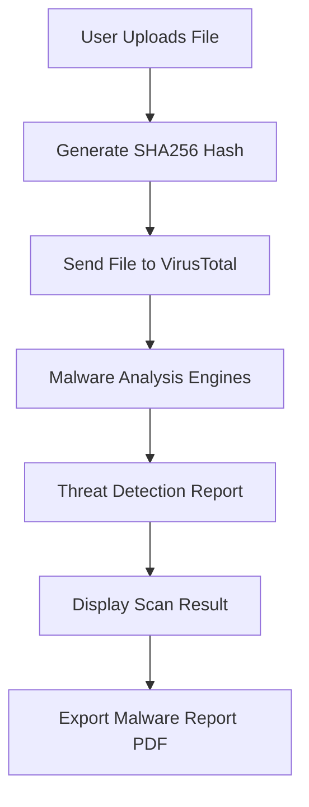

<!-- ========================= -->

<!-- FILESENTINEL CYBER README -->

<!-- ========================= -->

<p align="center">


</p>

<p align="center">


</p>

---

<p align="center">


</p>

---

<h2 align="center">

</h2>

FileSentinel is a **cybersecurity web application** that scans uploaded files for malware using the **VirusTotal API**.

The project provides a **modern hacker-style interface with real-time terminal scanning animations and matrix cyber background**.

This project was built as part of my **15 Day Developer Challenge**.

---

<h2 align="center">

</h2>

🛡️ Malware File Scanner
🧪 VirusTotal Threat Detection
📂 Drag & Drop File Upload
💻 Hacker Terminal Scan Animation
🟢 Matrix Hacking Background
📄 Export Malware Report (PDF)
📊 Detailed Threat Detection Report

---

<h2 align="center">

</h2>

<p align="center">

<a href="https://file-sentinel.vercel.app">


</a>

</p>

---

<h2 align="center">

</h2>

<p align="center">

<a href="https://github.com/somansinghal/FileSentinel">


</a>

</p>

---

<h2 align="center">

</h2>

<p align="center">


</p>

---

<h2 align="center">

</h2>



---

<h2 align="center">

</h2>

```
FileSentinel
│
├── index.html
├── style.css
├── script.js
├── matrix.js
├── config.js
└── assets
     └── logo.png
```

---

<h2 align="center">

</h2>

Clone repository

```
git clone https://github.com/somansinghal/FileSentinel
```

Enter project folder

```
cd FileSentinel
```

Run locally

```
open index.html
```

---

<h2 align="center">

</h2>

Create a free API key from **VirusTotal**.

Then add your key in:

```
config.js
```

Example

```
const API_KEY = "YOUR_VIRUSTOTAL_API_KEY"
```

---

<h2 align="center">

</h2>

<p align="center">

<a href="https://github.com/somansinghal">

</a>

<a href="https://www.linkedin.com/in/soman-singhal/">

</a>

</p>

---

<h2 align="center">

</h2>

If you like this project, consider giving it a ⭐ on GitHub.

---

<p align="center">


</p>

<p align="center">

🔥 Built during my **15 Day Developer Challenge**

</p>
